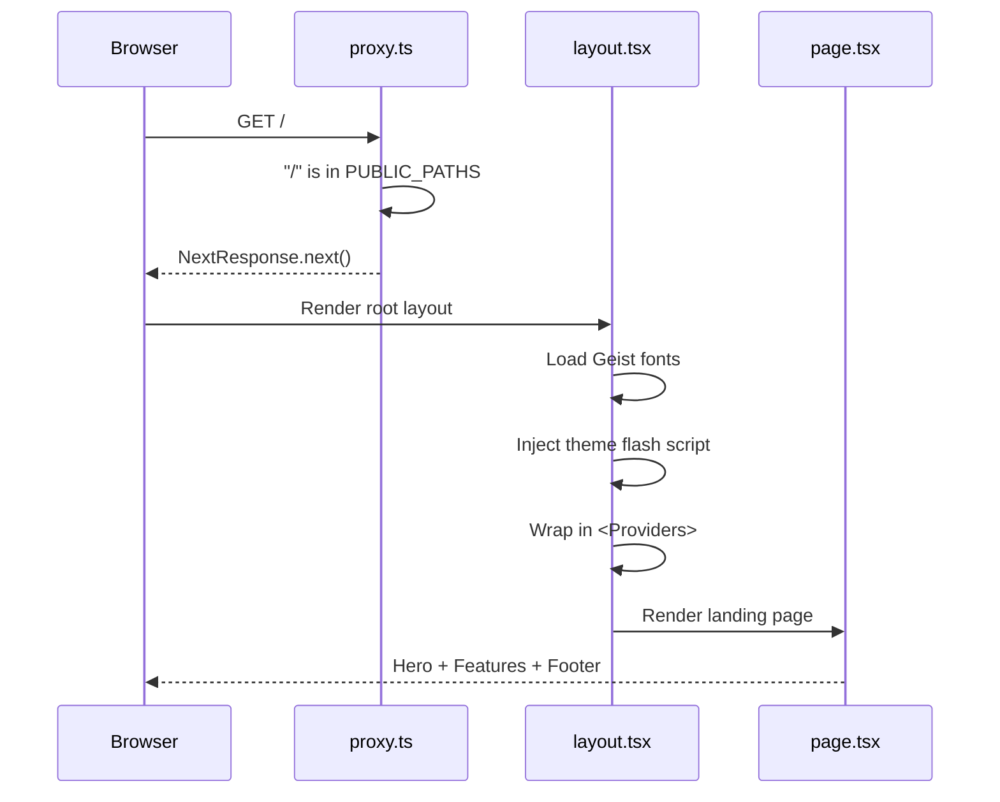
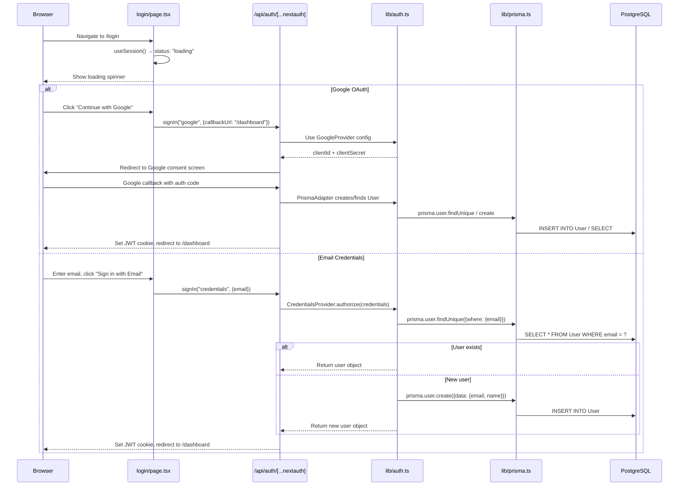
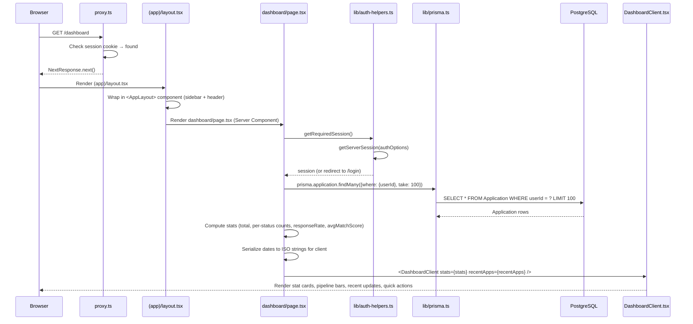
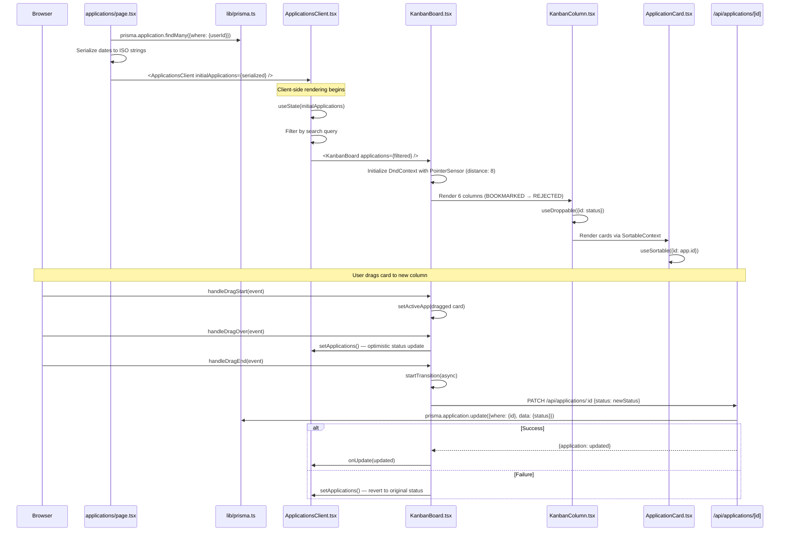
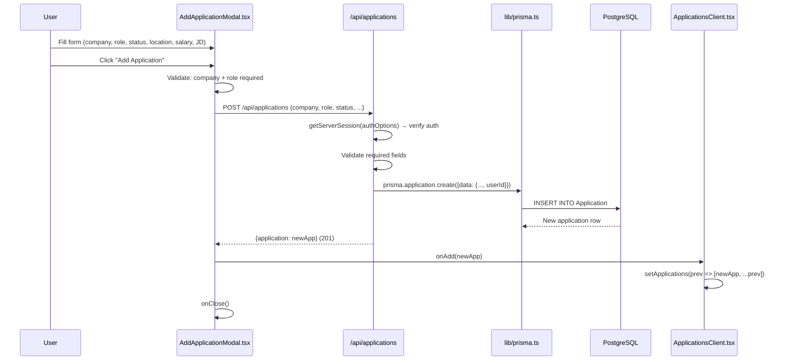
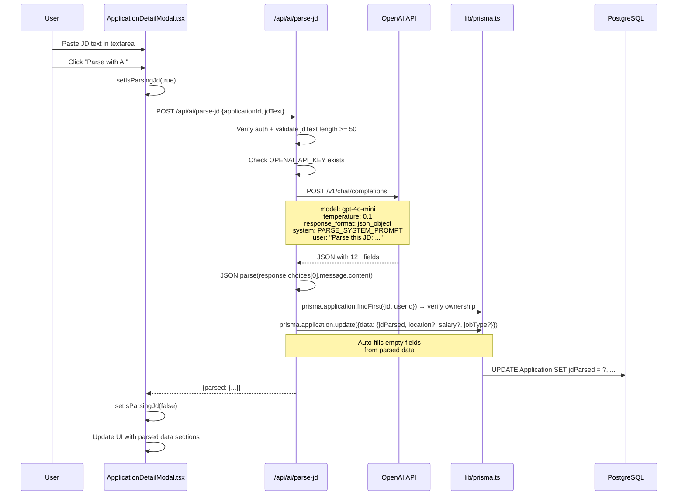
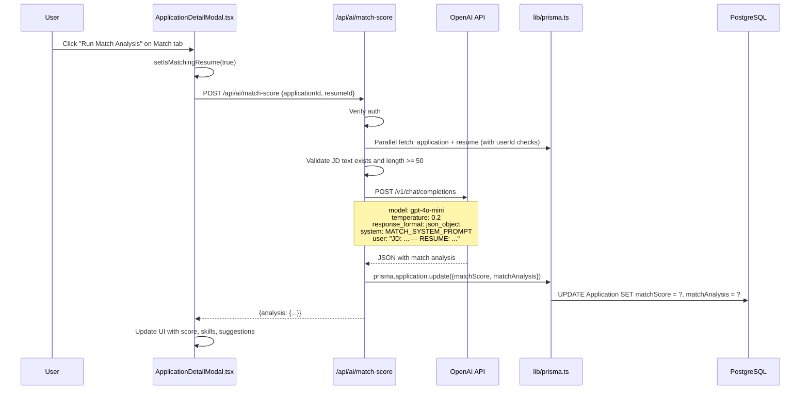
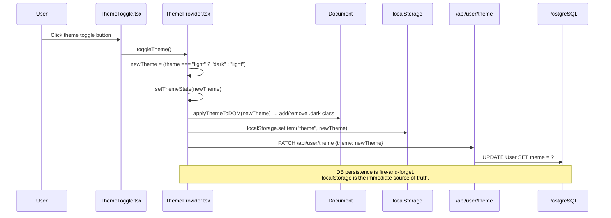

# 🔄 Execution Flow & Architecture Documentation: JobTracker AI

> **Document Version**: 1.0.0  
> **Last Updated**: October 2026  
> **Repository**: `ai-job-tracker`  

---

## 📌 Overview

This document maps the **complete execution flow** of the JobTracker AI application — from the moment a user opens the URL to every function call, data fetch, and API interaction. It covers entry points, component rendering order, the role of every file, what calls what, why each function exists, and how data flows through the system.

---

## 1. 🚪 Entry Points

The application has **three conceptual entry points** depending on context:

| Entry Point | File | When It Executes |
|---|---|---|
| **Root Layout** | [`src/app/layout.tsx`](file:///e:/AI%20Job%20tracker/ai-job-tracker/src/app/layout.tsx) | Every single page load — it's the outermost wrapper |
| **Middleware (Route Guard)** | [`src/proxy.ts`](file:///e:/AI%20Job%20tracker/ai-job-tracker/src/proxy.ts) | Before any page renders — checks auth cookies |
| **NextAuth Handler** | [`src/app/api/auth/[...nextauth]/route.ts`](file:///e:/AI%20Job%20tracker/ai-job-tracker/src/app/api/auth/%5B...nextauth%5D/route.ts) | On login/logout/callback — handles OAuth flow |

### 1.1 Root Layout — The True Entry Point

```
src/app/layout.tsx  (Server Component)
├── Imports globals.css (entire design system)
├── Loads Google Fonts: Geist Sans + Geist Mono
├── Sets HTML metadata (title, description, OpenGraph, PWA)
├── Injects inline <script> for theme flash prevention
├── Wraps children in <Providers> component
│   └── src/app/providers.tsx  ("use client")
│       ├── <SessionProvider>  (NextAuth context)
│       └── <ThemeProvider>    (Theme context)
│           └── {children}     (page content)
```

**Why this structure?**
- `layout.tsx` is a **Server Component** — it can set metadata, load fonts, and inject scripts.
- `providers.tsx` is a **Client Component** boundary — it wraps children in the client-side contexts that hooks like `useSession()` and `useTheme()` require.
- The inline `<script>` runs **before React hydrates**, reading `localStorage('theme')` and adding `.dark` to `<html>` to prevent a white flash.

### 1.2 Middleware — Route Guard

```
src/proxy.ts
└── export function proxy(req: NextRequest)
    ├── Checks if path is public: /, /login, /api/auth, /_next, static files
    │   └── YES → NextResponse.next() (allow through)
    ├── Checks for session cookie: next-auth.session-token
    │   └── FOUND → NextResponse.next() (allow through)
    └── NOT FOUND → Redirect to /login?callbackUrl=<original-path>
```

**Why?** Without middleware, unauthenticated users could navigate to `/dashboard` and see an empty shell before being redirected by client-side checks. The middleware intercepts at the edge — before any page rendering occurs.

---

## 2. 🗺️ Complete Route Map

```
src/app/
├── layout.tsx              → Root layout (Server Component, wraps everything)
├── providers.tsx           → Client-side context providers (SessionProvider + ThemeProvider)
├── page.tsx                → Landing page (public, Server Component)
├── globals.css             → Design system (tokens, themes, component styles)
├── manifest.ts             → PWA manifest generator
├── favicon.ico             → Browser favicon
├── icon.svg                → SVG app icon
│
├── login/
│   └── page.tsx            → Login page (Client Component)
│
├── privacy/
│   └── page.tsx            → Privacy Policy (Server Component)
│
├── terms/
│   └── page.tsx            → Terms of Service (Server Component)
│
├── (app)/                  → Route group (authenticated pages)
│   ├── layout.tsx          → Wraps all children in <AppLayout> (sidebar + header)
│   ├── dashboard/
│   │   ├── page.tsx        → Server Component: fetches stats, renders DashboardClient
│   │   └── DashboardClient.tsx → Client Component: renders stat cards, charts, actions
│   ├── applications/
│   │   ├── page.tsx        → Server Component: fetches applications, renders client
│   │   └── ApplicationsClient.tsx → Client Component: Kanban/List toggle, modals
│   ├── resume/
│   │   └── page.tsx        → Client Component: upload UI, resume management
│   └── settings/
│       └── page.tsx        → Client Component: profile, API key, notifications
│
└── api/                    → Backend API routes (serverless functions)
    ├── auth/[...nextauth]/route.ts  → NextAuth handler (GET + POST)
    ├── applications/
    │   ├── route.ts        → GET (list) + POST (create)
    │   └── [id]/route.ts   → GET + PATCH + DELETE (single application)
    ├── ai/
    │   ├── parse-jd/route.ts    → POST: OpenAI JD parsing
    │   └── match-score/route.ts → POST: OpenAI resume matching
    ├── resume/
    │   └── route.ts        → GET (list) + POST (upload + parse)
    └── user/
        └── theme/route.ts  → GET + PATCH (theme preference)
```

---

## 3. 🔁 Execution Flows — Every User Journey

### Flow A: First Visit (Unauthenticated User)



**What happens:**
1. `proxy.ts` checks if `/` is public → yes → allows through.
2. `layout.tsx` (server) loads fonts, sets metadata, injects theme script.
3. `providers.tsx` (client) initializes `SessionProvider` (no session) and `ThemeProvider`.
4. `page.tsx` (server) renders the static landing page with hero, features, and footer.

### Flow B: Login Flow



**What each function does:**

| Function | File | What It Does | Why |
|---|---|---|---|
| `signIn("google", ...)` | NextAuth client | Initiates OAuth redirect to Google | Triggers the full OAuth authorization code flow |
| `signIn("credentials", ...)` | NextAuth client | Sends email to `authorize()` callback | Demo login without password |
| `authorize(credentials)` | [`lib/auth.ts`](file:///e:/AI%20Job%20tracker/ai-job-tracker/src/lib/auth.ts) L21-44 | Finds or creates user by email | Auto-account creation for frictionless onboarding |
| `PrismaAdapter(prisma)` | [`lib/auth.ts`](file:///e:/AI%20Job%20tracker/ai-job-tracker/src/lib/auth.ts) L9 | Maps NextAuth operations to Prisma queries | Stores OAuth accounts, sessions, and users in PostgreSQL |
| `session` callback | [`lib/auth.ts`](file:///e:/AI%20Job%20tracker/ai-job-tracker/src/lib/auth.ts) L51-56 | Attaches `user.id` to the session object | Client components need `session.user.id` for API calls |
| `jwt` callback | [`lib/auth.ts`](file:///e:/AI%20Job%20tracker/ai-job-tracker/src/lib/auth.ts) L57-62 | Stores `user.id` in JWT token as `sub` | Persists user identity across stateless serverless requests |

### Flow C: Dashboard Page Load



**Key function details:**

| Function | File | What | Why |
|---|---|---|---|
| `getRequiredSession()` | [`lib/auth-helpers.ts`](file:///e:/AI%20Job%20tracker/ai-job-tracker/src/lib/auth-helpers.ts) L5-11 | Gets server session, redirects to `/login` if missing | Protects server components from unauthenticated access |
| `getOptionalSession()` | [`lib/auth-helpers.ts`](file:///e:/AI%20Job%20tracker/ai-job-tracker/src/lib/auth-helpers.ts) L13-15 | Gets session without redirecting | For pages that work with or without auth |
| `getTimeOfDay()` | [`DashboardClient.tsx`](file:///e:/AI%20Job%20tracker/ai-job-tracker/src/app/(app)/dashboard/DashboardClient.tsx) L260-265 | Returns "morning" / "afternoon" / "evening" | Personalizes the greeting header |

**Why server-side data fetching here?**
- The dashboard is a **read-only** page on initial load. By fetching data server-side with Prisma, we avoid an API round-trip and render the page with data already embedded — zero loading spinners.

### Flow D: Applications Page (Kanban Board)



**Component hierarchy:**

```
ApplicationsClient.tsx
├── State: applications[], showAddModal, selectedApp, viewMode, search
├── Toolbar: search input, view toggle (Kanban/List), "Add" button
│
├── viewMode === "kanban":
│   └── KanbanBoard.tsx
│       ├── DndContext (sensors, collision detection, handlers)
│       ├── 6× KanbanColumn.tsx (one per status)
│       │   ├── useDroppable() → makes column a drop target
│       │   ├── SortableContext → enables card sorting within column
│       │   └── N× ApplicationCard.tsx
│       │       ├── useSortable() → makes card draggable
│       │       ├── Shows: role, company, location, salary, matchScore, date
│       │       ├── Hover: 3-dot menu (Open JD link, Delete)
│       │       └── Click: opens ApplicationDetailModal
│       └── DragOverlay → ghost card during drag
│
├── viewMode === "list":
│   └── Table rows with inline status badges, match scores
│
├── showAddModal:
│   └── AddApplicationModal.tsx
│       └── Form → POST /api/applications → onAdd(newApp)
│
└── selectedApp:
    └── ApplicationDetailModal.tsx
        ├── Tab: "details" → Editable fields, notes
        ├── Tab: "jd" → Raw JD text + "Parse with AI" button
        └── Tab: "match" → Match analysis visualization
```

**Key drag-and-drop functions:**

| Function | File | What | Why |
|---|---|---|---|
| `handleDragStart` | [`KanbanBoard.tsx`](file:///e:/AI%20Job%20tracker/ai-job-tracker/src/components/kanban/KanbanBoard.tsx) L50-53 | Sets `activeApp` for DragOverlay ghost | Shows a visual preview of the card being dragged |
| `handleDragOver` | [`KanbanBoard.tsx`](file:///e:/AI%20Job%20tracker/ai-job-tracker/src/components/kanban/KanbanBoard.tsx) L55-71 | Optimistically updates card status in state | Card appears in the new column immediately during drag |
| `handleDragEnd` | [`KanbanBoard.tsx`](file:///e:/AI%20Job%20tracker/ai-job-tracker/src/components/kanban/KanbanBoard.tsx) L73-114 | Persists status change via API, reverts on failure | Keeps DB in sync; reverts UI if network fails |
| `handleDelete` | [`ApplicationCard.tsx`](file:///e:/AI%20Job%20tracker/ai-job-tracker/src/components/kanban/ApplicationCard.tsx) L40-48 | Calls `DELETE /api/applications/:id` | Removes card from board and database |

### Flow E: Adding a New Application



### Flow F: AI Job Description Parsing



**The AI system prompt** ([`parse-jd/route.ts`](file:///e:/AI%20Job%20tracker/ai-job-tracker/src/app/api/ai/parse-jd/route.ts) L6-22) instructs the model to extract:
- `role_title`, `company_name`, `location`, `employment_type`
- `salary_range`, `years_experience`, `education_required`
- `required_skills[]`, `preferred_skills[]`, `responsibilities[]`
- `company_description`, `perks[]`

**Why `temperature: 0.1`?** JD parsing is a **deterministic extraction task** — we want the same JD to always produce the same structured output. Low temperature minimizes creative variance.

### Flow G: Resume Upload & Skill Extraction

```mermaid
sequenceDiagram
    participant User
    participant ResumePage as resume/page.tsx
    participant API as /api/resume
    participant PdfParse as pdf-parse
    participant Prisma as lib/prisma.ts
    participant DB as PostgreSQL

    User->>ResumePage: Drop PDF file on upload zone
    ResumePage->>ResumePage: Validate file type (PDF/TXT) and size (<5MB)
    ResumePage->>API: POST /api/resume (FormData with file)
    API->>API: getServerSession() → verify auth
    API->>API: Validate file type + size

    alt PDF file
        API->>API: file.arrayBuffer() → Buffer.from()
        API->>PdfParse: pdf(buffer)
        PdfParse-->>API: {text: "extracted text..."}
    else TXT file
        API->>API: file.text()
    end

    API->>API: rawText.replace(/\u0000/g, "") → strip null bytes
    API->>API: Validate rawText.length >= 50
    API->>API: Match rawText against SKILL_KEYWORDS (40+ terms)
    Note over API: ["JavaScript", "TypeScript", "React",<br/>"Next.js", "Python", "AWS", ...]
    API->>Prisma: prisma.resume.updateMany({userId}) → set all isActive: false
    API->>Prisma: prisma.resume.create({filename, rawText, parsedSkills, isActive: true})
    Prisma->>DB: UPDATE Resume SET isActive = false; INSERT INTO Resume
    API-->>ResumePage: {resume: newResume} (201)
    ResumePage->>ResumePage: Reload resumes list
```

**Why keyword matching instead of AI for skills?**
- AI skill extraction would require an OpenAI call on every upload — slow and expensive.
- Keyword matching is **O(n)** and executes in <1ms.
- The curated keyword list covers 40+ industry-standard technologies.

### Flow H: AI Resume Match Scoring



**The match analysis returns:**
- `overall_score` (0-100), `grade` (A-F), `summary`
- `matched_skills[]`, `missing_skills[]`, `bonus_skills[]`
- `strengths[]`, `gaps[]`, `suggestions[]`
- `ats_keywords[]`, `interview_likelihood` (High/Medium/Low)

**Why `temperature: 0.2`?** Match scoring needs mostly deterministic analysis but benefits from slight creative latitude for **actionable suggestions** and **phrasing of strengths/gaps**.

### Flow I: Theme Toggle



**Three-layer theme sync explained:**

| Layer | What | Why |
|---|---|---|
| **Layer 1: Inline `<script>`** | Reads `localStorage` before React hydrates | Prevents white flash for dark-mode users |
| **Layer 2: React Context** | `ThemeProvider` manages `theme` state | Components reactively update icons, colors |
| **Layer 3: Database** | `PATCH /api/user/theme` persists to `User.theme` | Cross-device sync (new browser inherits preference) |

**On page load, theme is resolved in this priority:**
1. `localStorage` (instant, no network) — applied by inline script + `useEffect`
2. `GET /api/user/theme` (when session loads) — overwrites if DB has a different value
3. Default: `"light"` (fallback if neither exists)

---

## 4. 📂 File-by-File Role Reference

### Configuration Files

| File | Role | Called By |
|---|---|---|
| [`next.config.ts`](file:///e:/AI%20Job%20tracker/ai-job-tracker/next.config.ts) | Next.js configuration: `serverExternalPackages` for pdf-parse | Next.js build system |
| [`tsconfig.json`](file:///e:/AI%20Job%20tracker/ai-job-tracker/tsconfig.json) | TypeScript configuration: strict mode, path aliases (`@/*`) | TypeScript compiler |
| [`postcss.config.mjs`](file:///e:/AI%20Job%20tracker/ai-job-tracker/postcss.config.mjs) | PostCSS plugin config: `@tailwindcss/postcss` | CSS build pipeline |
| [`prisma.config.ts`](file:///e:/AI%20Job%20tracker/ai-job-tracker/prisma.config.ts) | Prisma CLI config: loads `.env.local` via `dotenv` | `prisma migrate`, `prisma studio` |
| [`prisma/schema.prisma`](file:///e:/AI%20Job%20tracker/ai-job-tracker/prisma/schema.prisma) | Database schema: 5 models (User, Account, Session, Application, Resume) + Status enum | Prisma ORM |
| [`package.json`](file:///e:/AI%20Job%20tracker/ai-job-tracker/package.json) | Dependencies, scripts (`dev`, `build`, `db:migrate`, `mobile:*`) | npm |

### Core Library Files

| File | Role | Key Exports | Called By |
|---|---|---|---|
| [`src/lib/prisma.ts`](file:///e:/AI%20Job%20tracker/ai-job-tracker/src/lib/prisma.ts) | Prisma client singleton with `@prisma/adapter-pg` driver adapter | `prisma` | Every API route, every server page |
| [`src/lib/auth.ts`](file:///e:/AI%20Job%20tracker/ai-job-tracker/src/lib/auth.ts) | NextAuth configuration: providers, adapter, JWT callbacks, custom sign-in page | `authOptions` | NextAuth handler, every `getServerSession()` call |
| [`src/lib/auth-helpers.ts`](file:///e:/AI%20Job%20tracker/ai-job-tracker/src/lib/auth-helpers.ts) | Session helper wrappers for server components | `getRequiredSession()`, `getOptionalSession()` | Server pages (dashboard, applications) |

### Type Definitions

| File | Role | Key Types |
|---|---|---|
| [`src/types/application.ts`](file:///e:/AI%20Job%20tracker/ai-job-tracker/src/types/application.ts) | Application data types | `Status`, `Application`, `ParsedJD`, `MatchAnalysis` |
| [`src/types/next-auth.d.ts`](file:///e:/AI%20Job%20tracker/ai-job-tracker/src/types/next-auth.d.ts) | NextAuth type augmentation: adds `id` to `session.user` | Module augmentation |

### Layout Components

| File | Role | Rendered By |
|---|---|---|
| [`src/components/layout/AppLayout.tsx`](file:///e:/AI%20Job%20tracker/ai-job-tracker/src/components/layout/AppLayout.tsx) | Sidebar nav + top header + main content area | `(app)/layout.tsx` |
| [`src/components/layout/ThemeProvider.tsx`](file:///e:/AI%20Job%20tracker/ai-job-tracker/src/components/layout/ThemeProvider.tsx) | Theme context provider: manages light/dark state, syncs to localStorage + DB | `providers.tsx` |
| [`src/components/layout/ThemeToggle.tsx`](file:///e:/AI%20Job%20tracker/ai-job-tracker/src/components/layout/ThemeToggle.tsx) | Sun/Moon toggle button with hydration guard | `AppLayout`, landing page, login page |
| [`src/components/layout/JTLogo.tsx`](file:///e:/AI%20Job%20tracker/ai-job-tracker/src/components/layout/JTLogo.tsx) | Custom SVG "JT" logo with configurable size | `AppLayout`, landing page, login page, legal pages |

### Kanban Components

| File | Role | Key Props |
|---|---|---|
| [`src/components/kanban/KanbanBoard.tsx`](file:///e:/AI%20Job%20tracker/ai-job-tracker/src/components/kanban/KanbanBoard.tsx) | DndContext wrapper, drag handlers, 6 columns + DragOverlay | `applications`, `setApplications`, `onUpdate`, `onDelete`, `onClickCard` |
| [`src/components/kanban/KanbanColumn.tsx`](file:///e:/AI%20Job%20tracker/ai-job-tracker/src/components/kanban/KanbanColumn.tsx) | Droppable column with header (status dot, label, count badge) | `id` (status), `label`, `applications`, callbacks |
| [`src/components/kanban/ApplicationCard.tsx`](file:///e:/AI%20Job%20tracker/ai-job-tracker/src/components/kanban/ApplicationCard.tsx) | Sortable draggable card with role, company, meta, match score | `application`, `isDragging`, `onDelete`, `onUpdate`, `onClick` |
| [`src/components/kanban/AddApplicationModal.tsx`](file:///e:/AI%20Job%20tracker/ai-job-tracker/src/components/kanban/AddApplicationModal.tsx) | Modal form for creating new applications | `onClose`, `onAdd` |
| [`src/components/kanban/ApplicationDetailModal.tsx`](file:///e:/AI%20Job%20tracker/ai-job-tracker/src/components/kanban/ApplicationDetailModal.tsx) | Full detail slide-over: 3 tabs (details, JD, match), AI triggers | `application`, `onClose`, `onUpdate` |

### API Route Handlers

| File | Methods | Endpoint | What It Does |
|---|---|---|---|
| [`api/auth/[...nextauth]/route.ts`](file:///e:/AI%20Job%20tracker/ai-job-tracker/src/app/api/auth/%5B...nextauth%5D/route.ts) | GET, POST | `/api/auth/*` | NextAuth catch-all: login, logout, callbacks, CSRF |
| [`api/applications/route.ts`](file:///e:/AI%20Job%20tracker/ai-job-tracker/src/app/api/applications/route.ts) | GET, POST | `/api/applications` | List applications (with search/filter/pagination) or create new |
| [`api/applications/[id]/route.ts`](file:///e:/AI%20Job%20tracker/ai-job-tracker/src/app/api/applications/%5Bid%5D/route.ts) | GET, PATCH, DELETE | `/api/applications/:id` | Read, update, or delete a single application (with ownership check) |
| [`api/ai/parse-jd/route.ts`](file:///e:/AI%20Job%20tracker/ai-job-tracker/src/app/api/ai/parse-jd/route.ts) | POST | `/api/ai/parse-jd` | Send JD text to OpenAI, receive structured JSON, save to application |
| [`api/ai/match-score/route.ts`](file:///e:/AI%20Job%20tracker/ai-job-tracker/src/app/api/ai/match-score/route.ts) | POST | `/api/ai/match-score` | Compare resume vs JD via OpenAI, save match score + analysis |
| [`api/resume/route.ts`](file:///e:/AI%20Job%20tracker/ai-job-tracker/src/app/api/resume/route.ts) | GET, POST | `/api/resume` | List resumes or upload PDF/TXT (parse text, extract skills, save) |
| [`api/user/theme/route.ts`](file:///e:/AI%20Job%20tracker/ai-job-tracker/src/app/api/user/theme/route.ts) | GET, PATCH | `/api/user/theme` | Read or update user's theme preference |

---

## 5. 🗃️ Database Schema & Relationships

```
┌──────────────┐       ┌──────────────┐       ┌──────────────┐
│     User     │───1:N─┤   Account    │       │ Verification │
│              │       │ (OAuth)      │       │    Token     │
│  id (cuid)   │       │              │       │              │
│  name        │       │ provider     │       │ identifier   │
│  email @uniq │       │ providerAcct │       │ token @uniq  │
│  emailVerif  │       │ access_token │       │ expires      │
│  image       │       │ refresh_token│       └──────────────┘
│  theme       │       └──────────────┘
│  createdAt   │
│  updatedAt   │       ┌──────────────┐
│              │───1:N─┤   Session    │
│              │       │              │
│              │       │ sessionToken │
│              │       │ expires      │
│              │       └──────────────┘
│              │
│              │       ┌─────────────────────┐
│              │───1:N─┤    Application      │
│              │       │                     │
│              │       │ id (cuid)           │
│              │       │ company, role       │
│              │       │ status (enum)       │
│              │       │ sourceUrl, jdRaw    │
│              │       │ jdParsed (JSON)     │
│              │       │ matchScore (Int?)   │
│              │       │ matchAnalysis(JSON) │
│              │       │ location, salary    │
│              │       │ jobType, notes      │
│              │       │ appliedAt           │
│              │       │ @@index([userId])   │
│              │       │ @@index([userId,    │
│              │       │          status])   │
│              │       └─────────────────────┘
│              │
│              │       ┌──────────────┐
│              │───1:N─┤    Resume    │
│              │       │              │
│              │       │ id (cuid)    │
│              │       │ filename     │
│              │       │ rawText      │
│              │       │ parsedSkills │
│              │       │ isActive     │
│              │       │ @@index(     │
│              │       │   [userId])  │
└──────────────┘       └──────────────┘
```

**Status Enum**: `BOOKMARKED | APPLIED | SCREENING | INTERVIEW | OFFER | REJECTED`

**Cascade Deletes**: When a `User` is deleted, all their `Account`, `Session`, `Application`, and `Resume` records are automatically deleted.

**Indexes**: `[userId]` and `[userId, status]` on Application; `[userId]` on Resume — optimized for the most common query patterns.

---

## 6. 🎨 Design System Architecture

The design system lives entirely in [`globals.css`](file:///e:/AI%20Job%20tracker/ai-job-tracker/src/app/globals.css) (535 lines, 16KB) and follows a **60/30/10 color architecture**:

```
@import "tailwindcss";              ← Loads Tailwind v4 base

@theme inline {                     ← Design tokens (fonts, spacing, radii, shadows)
  --font-sans, --font-mono
  --spacing-* (16 steps)
  --radius-* (8 steps)
  --shadow-* (5 levels)
  --animate-* (keyframes)
}

:root {                             ← Light mode colors (60/30/10)
  --color-background (60%)
  --color-surface-0..4 (30%)
  --color-primary, --color-accent (10%)
  --color-foreground, --color-muted
  --color-border, --color-ring
  --color-success/warning/danger/info
}

.dark {                             ← Dark mode overrides
  All --color-* redefined
}

/* Component classes */             ← Reusable UI components
.card, .card-surface, .card-interactive
.btn-primary, .btn-secondary, .btn-danger
.input, .select, .textarea
.label, .field-group, .field-error
.badge, .badge-*, .badge-success/warning/danger
.dialog, .overlay, .dropdown-menu
.loading-spinner
.transition-theme
```

**How themes work:**
1. CSS custom properties (`--color-*`) are defined under `:root` (light) and `.dark` (dark).
2. All components reference these variables: `bg-[var(--color-background)]`, `text-[var(--color-foreground)]`.
3. When `.dark` is added to `<html>`, all variables instantly resolve to their dark-mode values.
4. The `transition-theme` class adds smooth 200ms color transitions.

---

## 7. 📊 Function Call Graph — What Calls What

### Server-Side Call Chain (Page Load)

```
layout.tsx
  └── providers.tsx
        ├── SessionProvider (NextAuth)
        └── ThemeProvider
              └── useEffect → GET /api/user/theme → sync from DB

(app)/layout.tsx
  └── AppLayout.tsx
        ├── useSession() → reads JWT from cookie
        ├── usePathname() → highlights active nav item
        └── ThemeToggle.tsx
              └── useTheme() → reads from ThemeProvider context

dashboard/page.tsx (Server Component)
  ├── getRequiredSession()
  │     └── getServerSession(authOptions)
  │           └── Decodes JWT, returns {user: {id, name, email}}
  ├── prisma.application.findMany({where: {userId}})
  ├── Computes stats: total, per-status, responseRate, avgMatchScore
  └── DashboardClient.tsx (Client Component)
        └── Renders stat cards, pipeline bars, recent list
```

### Client-Side Call Chain (User Interactions)

```
ApplicationsClient.tsx
  ├── handleAdd(app) → setApplications([app, ...prev])
  ├── handleDelete(id) → DELETE /api/applications/:id → setApplications(filter)
  ├── handleUpdate(app) → setApplications(map)
  │
  ├── KanbanBoard.tsx
  │     ├── handleDragStart → setActiveApp(app)
  │     ├── handleDragOver  → setApplications(map: update status)
  │     └── handleDragEnd   → PATCH /api/applications/:id → revert on failure
  │
  ├── AddApplicationModal.tsx
  │     └── handleSubmit → POST /api/applications → onAdd(newApp) → onClose()
  │
  └── ApplicationDetailModal.tsx
        ├── Tab "details":
        │     └── handleSaveInfo → PATCH /api/applications/:id {location, salary, ...}
        ├── Tab "jd":
        │     └── handleParseJd → POST /api/ai/parse-jd {applicationId, jdText}
        └── Tab "match":
              └── handleMatchResume → POST /api/ai/match-score {applicationId, resumeId}
```

### API Route Call Chain

```
Every API route follows this pattern:

1. getServerSession(authOptions) → verify auth
2. Validate request body / params
3. prisma.<model>.<operation>() → database query
4. (For AI routes) fetch("https://api.openai.com/...") → OpenAI call
5. NextResponse.json({data}) → return response

Specific chains:

POST /api/ai/parse-jd
  → getServerSession → verify userId
  → validate jdText.length >= 50
  → check OPENAI_API_KEY
  → fetch(OpenAI, {model: "gpt-4o-mini", messages, temperature: 0.1})
  → JSON.parse(response)
  → prisma.application.findFirst → verify ownership
  → prisma.application.update → save jdParsed + auto-fill fields
  → return {parsed}

POST /api/resume
  → getServerSession → verify userId
  → formData.get("file")
  → validate type (PDF/TXT) + size (<5MB)
  → pdf(buffer) or file.text()
  → rawText.replace(/\u0000/g, "")
  → validate rawText.length >= 50
  → SKILL_KEYWORDS.filter(match)
  → prisma.resume.updateMany → deactivate all
  → prisma.resume.create → save new active resume
  → return {resume}
```

---

## 8. 🔐 Security Model

| Layer | Protection | Implementation |
|---|---|---|
| **Route Guard** | Middleware blocks unauthenticated access to protected routes | `proxy.ts` checks session cookies before page renders |
| **API Auth** | Every API route calls `getServerSession(authOptions)` | Returns 401 if no valid session |
| **Data Isolation** | All DB queries include `userId: session.user.id` in WHERE | Users can never access other users' data |
| **Ownership Verification** | PATCH/DELETE routes verify `findFirst({id, userId})` before mutation | Prevents IDOR attacks |
| **Input Validation** | Required fields, length checks, enum validation | Prevents malformed data in database |
| **API Key Security** | `OPENAI_API_KEY` is server-side only (env variable) | Never exposed to client bundle |
| **CSRF Protection** | NextAuth includes built-in CSRF tokens | Prevents cross-site request forgery |
| **XSS Prevention** | React's JSX auto-escaping + CSP-ready architecture | No `dangerouslySetInnerHTML` except the safe theme script |
